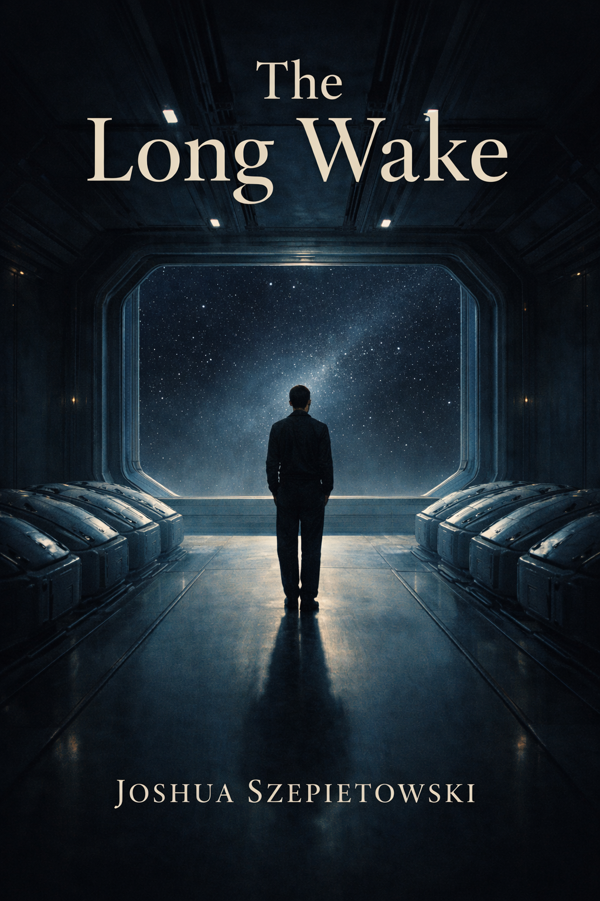

# The Long Wake

A novel about waiting.

---

## About

**The Long Wake** is a literary science fiction novel about a man who wakes from cryogenic sleep decades too early on an interstellar vessel. The ship cannot put him back under. Everyone else remains frozen. The future he was meant to live in has not arrived yet.

He is conscious in a world that is still asleep.

This is a story about hopelessness, survival, and the slow return of the desire to keep living. It is not an adventure. It is not a redemption arc. It is about continuing.

## Themes

- Waiting without knowing when it ends
- The collapse of the future
- Wanting to disappear
- Being forced to remain
- The smallest possible motion forward

## Structure

- 18 chapters
- ~45,000 words
- Five emotional movements: Waking, Refusal, Limbo, Friction, Motion

## Tone

Restrained. Grounded. Observant.

Corridors. Lights. Air recyclers. Food packets. The quiet of a ship meant for sleeping people.

The science fiction is a lens, not a shield.

---

*This novel exists to explore and metabolize a real human experience of catastrophic hopelessness and survival. It does not glamorize or romanticize self-harm. It witnesses suffering and allows motion to return.*
